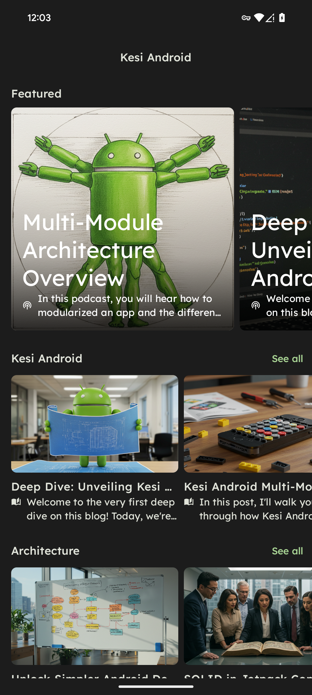
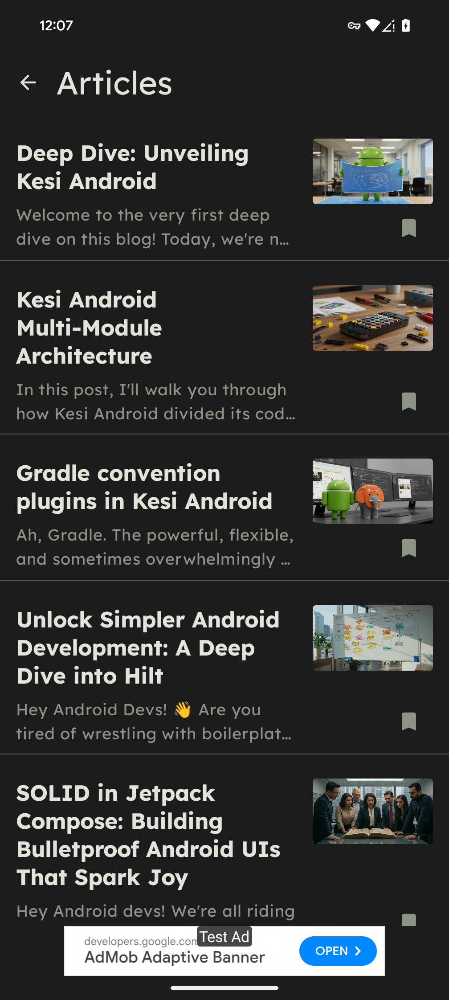
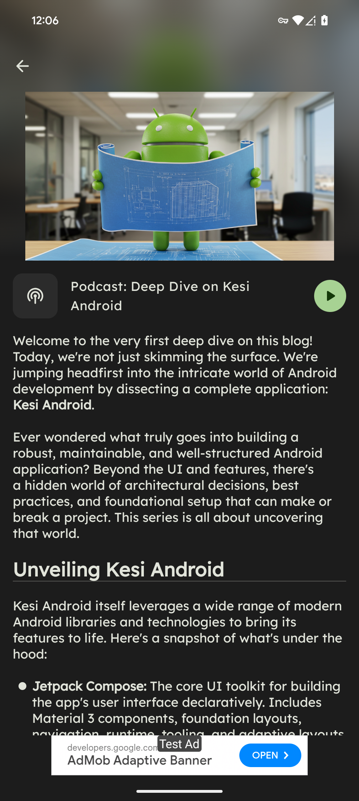
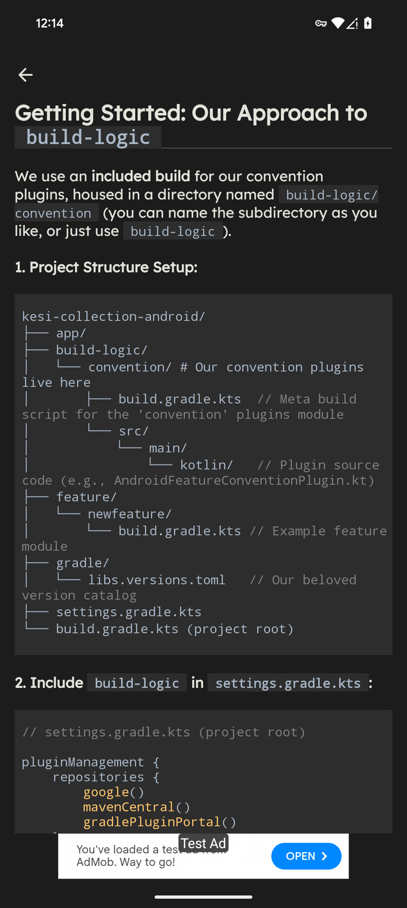
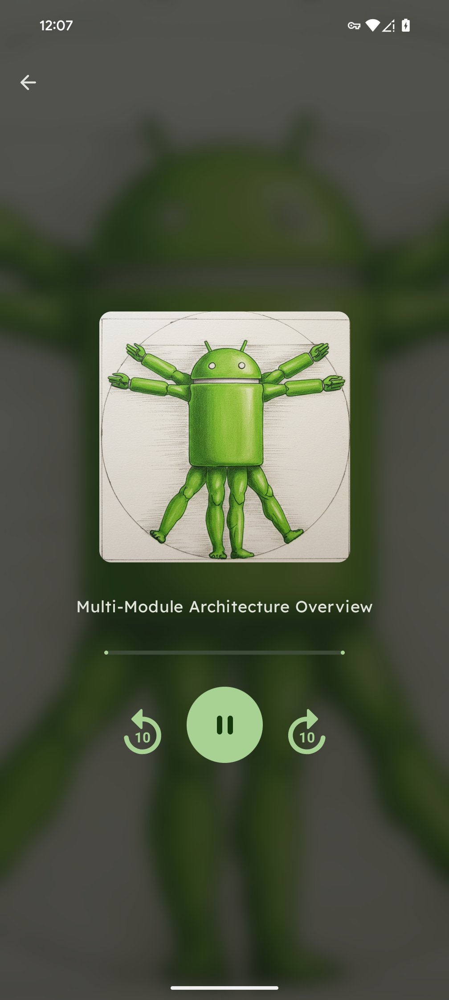

# KesiAndroid

## Description

KesiAndroid is an Android application designed to deliver insightful posts and articles on various Android development topics. Stay updated with the latest trends and best practices in areas like:

* **Hilt:** Dependency injection framework.
* **Jetpack Compose:** Modern UI toolkit for building native Android UIs.
* **Clean Architecture:** Principles for robust and maintainable app structure.
* And many more Android-related subjects!

The app also features **podcasts** accompanying some posts, offering explanations in a more accessible audio format.

## Screens

KesiAndroid is primarily composed of three main screens:

1.  **Discover Screen:** Displays a list feature and promoted content.
2.  **Articles Screen:** Displays a list of available posts and articles.
3.  **Article Screen:** Shows the detailed content of a selected post, potentially including embedded media.
4.  **Audio Player Screen:** Provides controls for listening to associated podcasts.

  
  
  
  
  

## Features

* Browse and read articles on Android development topics.
* Listen to podcasts explaining concepts in a simpler way.
* Built entirely with modern Android development practices (Kotlin, Jetpack Compose).
* Utilizes Clean Architecture principles.

## Libraries Used

This project leverages a wide range of modern Android libraries and technologies:

* **Jetpack Compose:** The core UI toolkit for building the app's user interface declaratively. Includes Material 3 components, foundation layouts, navigation, runtime, tooling, and adaptive layouts for various screen sizes.
* **Hilt:** Used for dependency injection throughout the application, integrating with ViewModels and Navigation Compose.
* **Kotlin Coroutines:** For managing background threads and asynchronous operations efficiently.
* **Retrofit & OkHttp:** Handle networking operations for fetching article and podcast data from APIs. Includes logging interceptor for debugging.
* **Kotlin Serialization:** Used for parsing JSON data retrieved from the network.
* **Coil:** An image loading library optimized for Kotlin and Jetpack Compose, used to display images within articles.
* **Media3 (ExoPlayer):** Powers the audio playback functionality for podcasts, including UI components integrated with Compose.
* **Jetpack Lifecycle:** Manages UI component lifecycles, especially integrating ViewModels with Compose.
* **Jetpack Navigation:** Handles in-app navigation between composable screens.
* **Jetpack DataStore:** Used for storing simple key-value data, like user settings or preferences.
* **Android KTX:** Provides helpful Kotlin extension functions for Android framework APIs.
* **Firebase:**
    * **Analytics:** For tracking user interactions and app usage patterns.
    * **Crashlytics:** For monitoring application crashes and stability.
* **Markwon:** Renders Markdown formatted text within the Article screen.
* **Google Play Services:** Includes the Mobile Ads SDK for displaying ads.
* **Android Core:** Includes utilities like the SplashScreen API.
* **Testing:** A comprehensive suite of testing libraries is used:
    * **JUnit:** Basic unit testing framework.
    * **Kotlin Test:** Kotlin-specific testing utilities.
    * **Robolectric:** For running Android tests on the JVM.
    * **AndroidX Test:** Core testing utilities, rules, and runner for instrumentation tests.
    * **Espresso:** For UI testing.
    * **UI Automator:** For cross-app UI testing.
    * **Compose UI Tests:** Specific tools for testing Jetpack Compose UIs.
    * **Hilt Testing:** Support for testing Hilt-injected components.
    * **Coroutines Test:** Utilities for testing Kotlin Coroutines.
    * **Coil Test:** Utilities for testing image loading scenarios.
